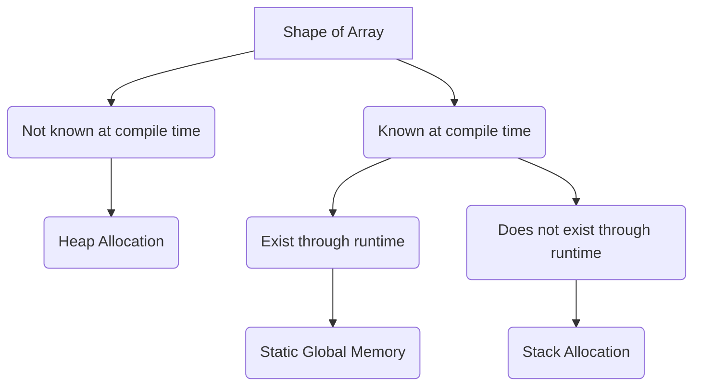

#concept #java

| Type                | Description                                                                     | Examples                   |
| ------------------- | ------------------------------------------------------------------------------- | -------------------------- |
| Scalar              | Occupies a fixed amount of memory                                               | int, double, char          |
| Composite           | Aggregation of simple types                                                     | int[]                      |
| Ordinal             | Values belong to a finite range of integer values                               | enum                       |
| Enumeration         | Finite set of values explicitly enumerated                                      | ordinal; scalar; primitive |
| Subrange            | Contiguous sequence of an ordinal type                                          | for _ in range(n)          |
| Record              | Data classes                                                                    |                            |
| Union               | types share memory location; size determined by largest                         |                            |
| Array               | Memory is allocated in a block; elements are stored consecutively on that block |                            |
| Set                 | Unordered unique elements; union and intersection operations                    |                            |
| List                | Usually implemented with array or linked nodes                                  |                            |
| Sum Type            | Only 1 type can be used at a time                                               | enum                       |
| Product Type        | Compound type                                                                   | tuples or records          |
| Recursive Type      | Objects contain one or more reference to other objects of same type             | lists                      |
| Algebraic Data Type | Represents value of several possibilities                                                                                |                            |

Records - are like Python @dataclass