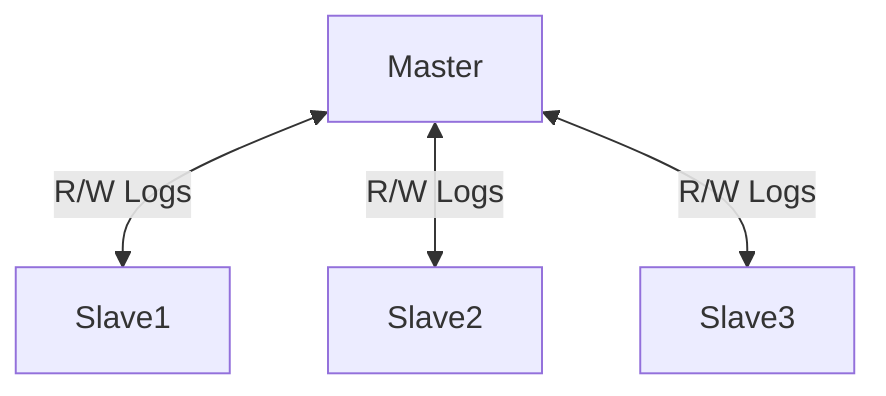
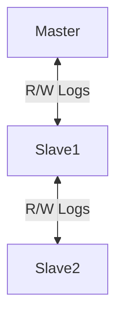

# Master Slave Replication

There's inherent replication delay, hurts write performance to keep consistency across all nodes.

Slaves need to execute in the same order as Master
-> Cannot parallelize

Parallel Replication (MySQL)
-> Specifies which tables can be parallelized

Promoting slaves to master
-> Need to resync the slave replicas
-> Another slave may be more ahead than the new Master

# Alternative 

Having another slave be the master of another slave will **compound** the replication delay.