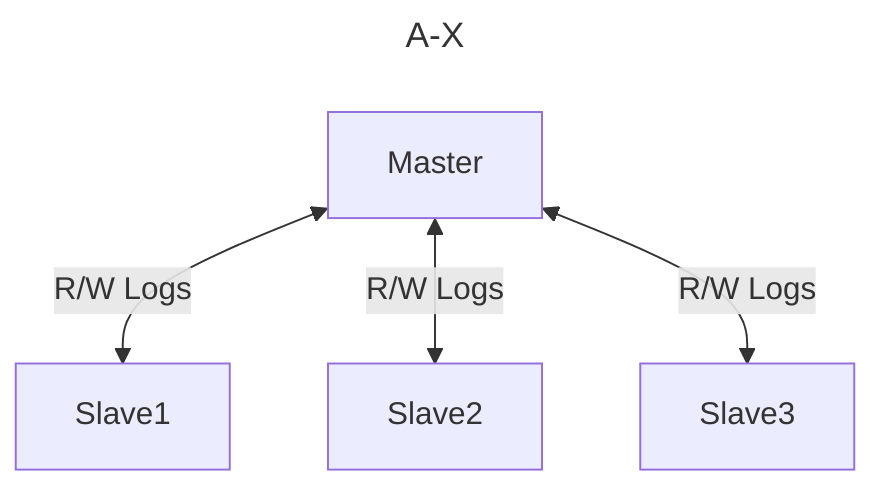
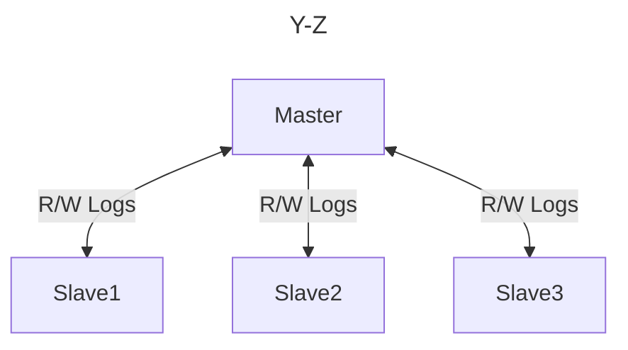

You can combine shading and replication in your systems.

# MySQL Shard

Routing
-> Service Discovery
-> Routing Request to Shard

# MongoDB Shard

Each shard will have a `mongos` utilize that will forward the request to the correct shard

# Consistent Hashing

The idea is you have a ring, and on the ring you have nodes that are responsible for subset of the data. Say node 1 may be responsible for the range 1000-3000, node 2; 3000-5000, and so on.

When a new node is added to the ring, it will start migrating data from the node before it. During this process the new node will not receive requests directly.  Every new request to the new node's range goes to the old node and replicated. 

>[!info] Example
>![[ConsistentHashing]]

# Replication Factor

The replication factor determines how many nodes should keep a copy of the data. There's a concept of home and failover. If the replication factor is 2, then the write will happen to the home node and replicated to the next node. If it is 3, it will be replicated to the next 2 nodes.

>[!info] Example
>![[ReplicationFactor]]

With this replication, when the home node goes down, the next node can take over. And when the downed node comes back, it will announce itself as a new node.

You can design partition tolerant systems using the ring, but you have to decide if you want availability or consistency.