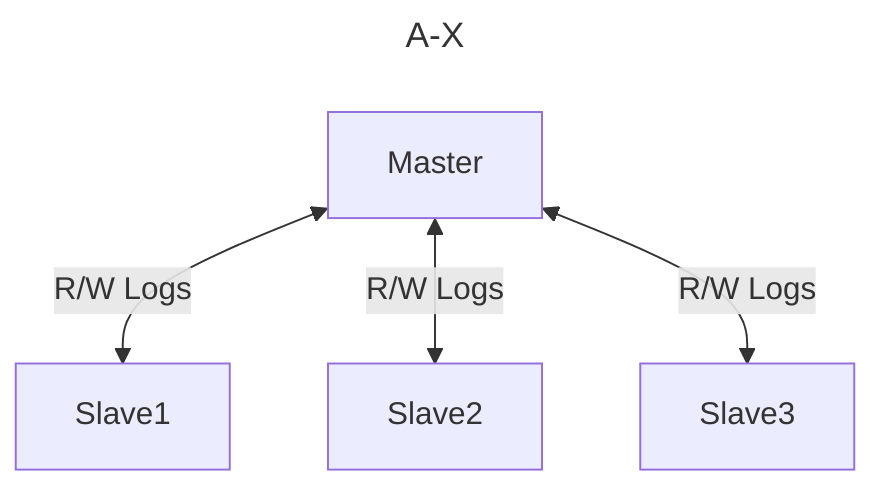
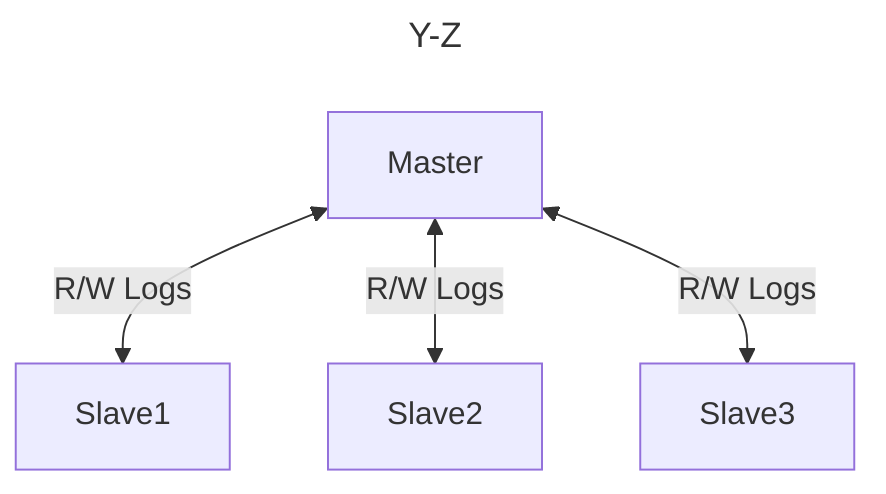

You can combine shading and replication in your systems.

# MySQL Shard

Routing
-> Service Discovery
-> Routing Request to Shard

# MongoDB Shard

Each shard will have a `mongos` utilize that will forward the request to the correct shard

# Consistent Hashing

The idea is you have a ring, and on the ring you have nodes that are responsible for subset of the data. Say node 1 may be responsible for the range 1000-3000, node 2; 3000-5000, and so on.

When a new node is added to the ring, it will start migrating data from the node before it. During this process the new node will not receive requests directly.  Every new request to the new node's range goes to the old node and replicated. 

>[!info] Example
>Say node 1 may be responsible for the range 1000-3000, node 2; 3000-5000, and so on.
>I then add a new node that will be responsible for the range 2000-3000.
>It will start copying data and replicating data from node 1 and when it is done, it is up to the operator if the data from range 2000-3000 should be dropped from node1.

# Replication Factor