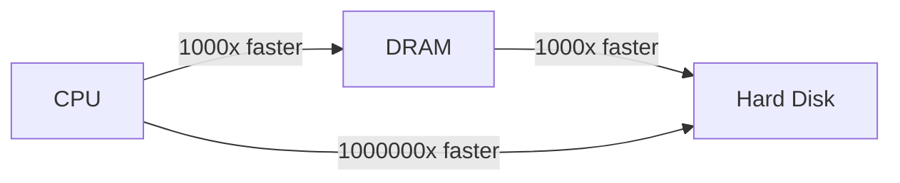

- CPU speeds are in the nanoseconds
- CPU internal speed is 10-100x RAM
- Typical internal memory is from 256 MB to several GB

- DRAM speeds are in microseconds

tldr; Disk are a lot bigger, but they are much slower.

